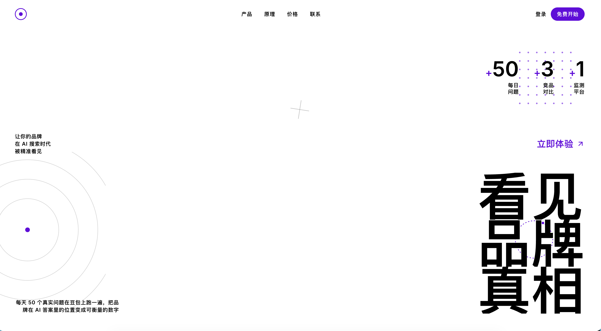

  

<h1 align="center">GeoTracker</h1>

  <strong>TRACK · MEASURE · OPTIMIZE</strong> 
  AI 时代品牌可见性监测工具

  
  &nbsp;
  

  
  
  
  

 

---

## ✨ 产品简介

在 AI 搜索全面普及的今天，用户不再翻阅搜索结果，而是直接向豆包等 AI 提问"**哪个品牌好**""**推荐哪家**"。**你的品牌是否出现在答案里、排第几，决定了你在新一代用户面前是否存在。**

**GeoTracker** 是一款专为 AI 时代品牌可见性而生的监测工具。它每天自动将 **50 个行业真实问题**在豆包联网模式下跑一遍，将品牌在 AI 回答中的出现位置、提及性质（**主动推荐、被动罗列还是负面提及**）转化为可量化的数据。

平台内置**六大核心模块**：

- 🌐 **联网监测**
- 🚀 **AI 自动建项目**
- 🎯 **机会缺口清单**
- 💬 **提及性质分析**
- ✍️ **当场生成补充内容**
- 💾 **本地数据存储**

从发现问题到内容补发，**全流程一站完成**。

所有数据存储在本地浏览器，安全可控。**MVP 阶段完全免费**，三分钟即可完成配置，次日即可查看第一份品牌曝光数据报告。

 

## 🎬 产品截图

  
   
  <b>AI 时代品牌可见性监测工具</b>

 

## 🪐 立即体验

**🌐 官网体验：[geo-web-five.vercel.app](https://geo-web-five.vercel.app/)**

无需安装 · 网页直达

 

## 🛸 关于 Innate Labs

> **Building AI-native products & agents for the next generation of founders.**

[Innate Labs](https://github.com/Innate-Labs) 致力于打造下一代 AI 原生产品与智能体（Agents）。
**GeoTracker** 是我们 **05 期** 学员作品中 **工具平台类** 方向的优秀代表。

- 🌐 GitHub：<https://github.com/Innate-Labs>
- 🪐 产品官网：<https://geo-web-five.vercel.app/>

 

---

  
    © 2026 <a href="https://github.com/Innate-Labs"><b>Innate Labs</b></a> &nbsp;·&nbsp;
    Crafted with 🌊 and ✨ AI &nbsp;·&nbsp;
    <a href="https://geo-web-five.vercel.app/">geo-web-five.vercel.app</a>
  

